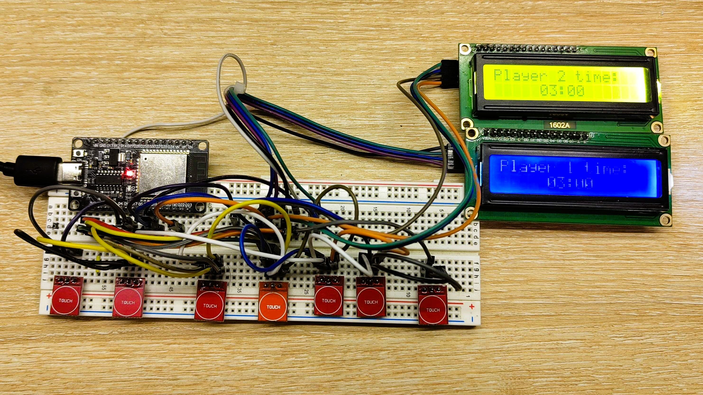
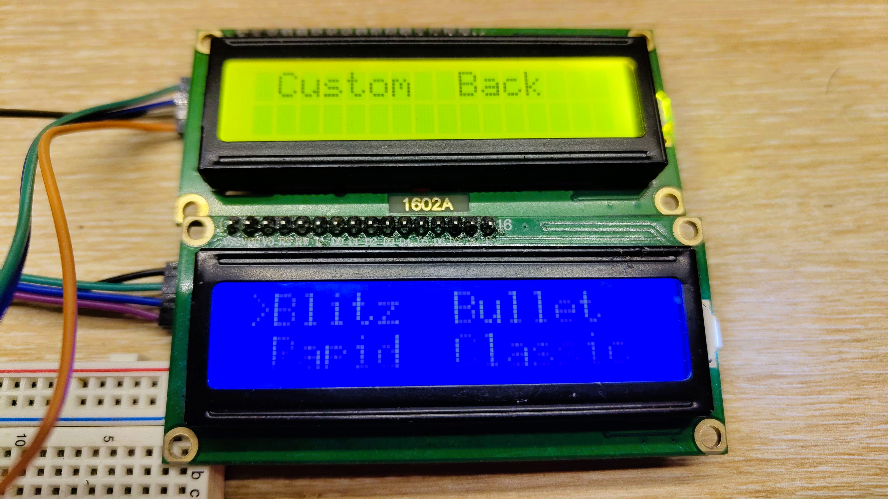

# ESP32-Chess-Clock
ESP32-based chess clock using ESP-IDF.

# Version 2.2

This project consists of a dual LCD screen displaying the time counter for each player. When the clock starts, it defaults to a 3-minute timer with an increment of 2 seconds per move.

Several buttons are available to control the clock:
|Reset|Pause|Player1|Player2|-|+|menu/ok|
|-----|-----|-------|-------|-|-|-------|

This picture shows the prototyping process. I use TTP223 capacitive touch sensors instead of generic push buttons, but you can always use regular buttons with pull-up resistors.



The menu offers different presets:
- BLITZ
- BULLET
- RAPID
- CLASSICAL
- CUSTOM
- BACK

<u>Note</u>: These presets are not strictly representative of standard time settings and increments, as they may vary depending on the players or their preferences.

The blue screen is a bit difficult to make out in the photo, as it's not very clear what's displayed on it, but here's a picture:



## Future Improvement

- The custom preset has not been implemented yet. When selected, the system crashes and reboots.
- add an incremental rotary encoder instead of buttons
- add a buzzer

## Code

Further explication of the code can be found [here](docs/Code.md).

# Installation

## ESP-IDF

I use a generic esp32 for this project.

1. You need `esp-idf` installed and configured in your system before using this project.
2. Navigate to your project directory, or clone a sample project from the ESP-IDF examples:

```bash
# Navigate to your project directory
cd ~/my_project
# Clone the project
git clone --recursive https://github.com/pungvincent/ESP32-Chess-Clock.git
cd ESP32-Chess-Clock
```

3. Build your project: `idf.py build`
4. Flash the firmware to the ESP32: `idf.py -p /dev/ttyUSB0 flash`

<u>Important Note</u>:
```
Ensure that /dev/ttyUSB0 is the correct serial port for your device. On Linux/macOS, you can check the port by running ls /dev/tty* before and after plugging in the ESP32. On Windows, it may appear as COMx (e.g., COM3).
If the serial port is different from /dev/ttyUSB0, replace it with the correct port (e.g., /dev/ttyACM0, COM3, etc.).
```

5. Monitor the ESP32 output: `idf.py -p /dev/ttyUSB0 monitor`

**Optional**:
- Clean your project: `idf.py fullclean`
- Reset the ESP32: `idf.py -p /dev/ttyUSB0 reset`

## LCD 16x2 screen

Each LCD screen is driven by a PCF8574 module. To differentiate them, each LCD must have a unique I2C address.
Further explanation can be found [here](docs/LCD.md).

Here is the current configuration: 

| MSB  | A2 | A1 | A0 | I2C Address | Assigned To  |
|------|----|----|----|-------------|--------------|
| 0100 |  1 |  1 |  1 | 0x27        | Player 1 LCD |
| 0100 |  1 |  1 |  0 | 0x26        | Player 2 LCD |

# Resources
This project uses the following tutorial for driving the 16x2 LCD display:
- [How to use I2C in ESP32 || Interface LCD16x2](https://controllerstech.com/i2c-in-esp32-esp-idf-lcd-1602/#info_box)

# License

This project is licensed under the MIT License - see the [LICENSE](./LICENSE) file for details.

This project uses ESP-IDF, which is licensed under the Apache License 2.0. See the [ESP-IDF repository](https://github.com/espressif/esp-idf) for more details.
This project uses the [Interface LCD16x2 Tutorial](https://controllerstech.com/i2c-in-esp32-esp-idf-lcd-1602/#info_box). Please refer to the repository for more details.